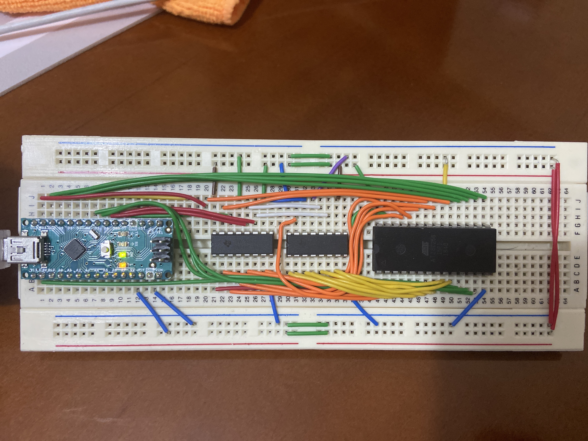

# eeprom_programmer
A very basic EEPROM programmer, compatible with chips with up to 15 address lines.

# Protoboard assembly

##### This project was inspired by and based on [Ben Eater's programmer](https://github.com/beneater/eeprom-programmer)
